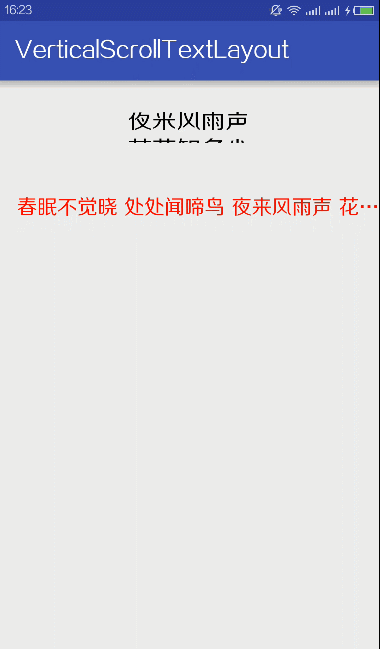

#VerticalScrollTextLayout

TextView垂直滚动布局。

> 目前Github的TextView垂直滚动大多是通过重写onDraw方法，使用Canvas重新绘制文字实现。

> 但是这样做有一个致命的缺点:在重绘后TextView的自动折行、maxLines、ellipsize等属性将会失效。

##项目原理

使用两个TextView不停的交替展示文字，形成滚动效果。

##效果展示


##使用方法

###布局

```html
<com.ssyijiu.verticalscrolltextlayout.VerticalScrollTextLayout
        android:layout_marginTop="30dp"
        android:id="@+id/scroll_layout"
        android:layout_width="match_parent"
        android:layout_height="wrap_content">
        <!--
            VerticalScrollTextLayout使用两个TextView交替展示动画，
            请确保下面的两个TextView的代码一模一样。
        -->
        <TextView
            android:textColor="#000"
            android:layout_width="match_parent"
            android:layout_height="wrap_content"
            android:gravity="center"
            android:textSize="23sp" />

        <TextView
            android:textColor="#000"
            android:layout_width="match_parent"
            android:layout_height="wrap_content"
            android:gravity="center"
            android:textSize="23sp" />
</com.ssyijiu.verticalscrolltextlayout.VerticalScrollTextLayout>
```

###代码

```
scroll_layout.setTextList(textList) // 设置滚动文字
             .setStaticTime(1000)   // 设置停留时间
             .setScrollTime(500);   // 设置滚动时间
scroll_layout.startScroll();        // 开始滚动

@Override
protected void onDestroy() {
    // 停止滚动
    scroll_layout.stopScroll();
    super.onDestroy();
}
```

## 联系作者
- Github: ssyijiu
- E-mail: lxmyijiu@163.com
- WeChat: ssyijiu11

##License

Copyright 2016 ssyijiu

Licensed under the Apache License, Version 2.0 (the "License");
you may not use this file except in compliance with the License.
You may obtain a copy of the License at

   http://www.apache.org/licenses/LICENSE-2.0

Unless required by applicable law or agreed to in writing, software
distributed under the License is distributed on an "AS IS" BASIS,
WITHOUT WARRANTIES OR CONDITIONS OF ANY KIND, either express or implied.
See the License for the specific language governing permissions and
limitations under the License.
